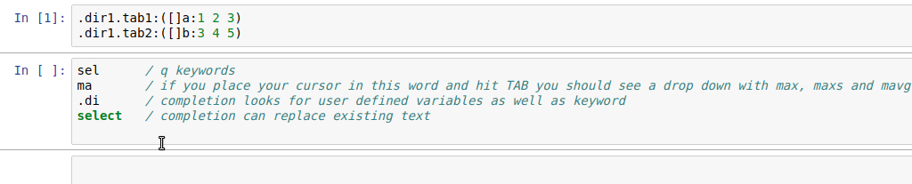

# jupyterq 
Jupyter kernel for kdb+. Features include

- Syntax Highlighting for q
- Code completion for q keywords, .z/.h/.Q/.j namespace functions, and user defined variables
- Code help for q keywords and basic help (display and type information) for user defined objects
- script like execution of code (mulitline input)
- Inline display of charts created using embedPy and matplotlib
- console stdout/stderr capture and display in notebooks
- Inline loading and saving of scripts into and from notebook cells


## Status

Jupyterq is still in development, please write to ai@kx.com with any issues or suggestions.

## Requirements 
- kdb+>=? v3.5 64-bit
- Anaconda Python 3.x
- [embedPy](https://github.com/KxSystems/embedPy)


## Build and Installation

After you have installed embedPy install the Python dependencies with 

pip
```bash
pip install -r requirements.txt
```
or with conda
```bash
conda install --file requirements.txt
```
### Download

Download the appropriate release archive from the [releases](../../releases/latest) page.


### Linux/Mac

Ensure QHOME is set and you have a working version of q in your PATH, and run

```bash
./install.sh
```

### Windows
Ensure QHOME is set and you have a working version of q in your PATH, and run

```
install.bat
```

Jupyter console, notebook and QtConsole should work, Jupyter lab has not been tested

### Mac
On mac there seem to be issues with MKL when using in embedded python mode e.g. (https://github.com/ContinuumIO/anaconda-issues/issues/6423)

If you have a similar issue using Anaconda Python, the command below may resolve the issue.

```conda install nomkl```


## Running after install

To run the jupyter console
```
jupyter console --kernel=qpk
```
To run the example notebook
```
jupyter notebook kdb+Notebooks.ipynb
```


## Using notebooks

See the notebook kdb+Notebooks.ipynb for full interactive examples and explanation, it should be viewable on github.

### Running code
The simplest case is running some code and getting a result. There are 3 things to note here:

- Each line of code which would produce output at a console produces output in the notebook.
- stderr/stdout are printed separately to the output in the usual way for notebooks, note that if your print statement such as `-1"hello world!"` has an output (here -1) then the output will be displayed, you can suppress this with a semicolon at the end of a statement as usual.
- Execution is 'script like', i.e. you can use the normal rules of indentation for functions, if/while blocks, and select/update/delete statements.


### Code completion and getting help

The notebook supports code completion of q keywords and anything in the `.h`, `.Q`, `.z` and `.j` directories of q. 
Completion also works on user defined variables, provided they exist on the server. If you've defined variables in the *same* cell they won't exist yet in the server process before the cell is first executed, but notebooks will complete these for you locally.

Code completion in notebooks is accessed via the TAB key.

#### Completion



#### Help

Help is available on q keywords and built in commands, embedPy and Python foreign objects, and user defined variables.
For user defined variables the console representation along with datatype information is displayed.

In notebooks help is accessed with SHIFT+TAB, this should pop up a window in the notebook, to see an html version of the help with links to the online documentation for the function, hit SHIFT+TAB 4 times in succession (or use the buttons in the help window).


### Errors
Errors are displayed in red and fall into 2 classes

- Parse errors, parsing of the cell content is checked by the kernel before sending to the server for evaluation, the usual q parsing rules apply. Note that for foreign languages (lines preceded by `p)` for example) parsing is not checked.

- Evaulation (runtime errors), these are reported from the server, one important thing to note is that as with q scripts, lines up to where the error occurred will have been executed, e.g.
```
a:1
b:a+`
a:2
```

 will result in a having a value of 1.


### System commands

System commands can be used with the `\` operator at the start of a line in a code cell.

**Note**: \d does not currently work.

### Loading and saving code

In addition to loading code with `\l` , code from a script *on the server* can be loaded directly into a cell using a 'magic' command

```/%loadscript filename```

This will not attempt to execute the code and any code in the rest of the cell will not execute.


```/%savescript filename [overwrite]```

Will save contents of the cell as a script, optionally overwriting the script if it already exists


### Python and inline display

Along with k and q code, python code can be run in a q process using embedPy, charts created using matplotlib will be displayed inline in the notebook. 

**Note** this is experimental currently


Cells with /%python anywhere in the cell at the start of a line will be evaluated as python code, this only intended to make it easier to copy and paste python snippets into kdb+ notebooks, the language for syntax highlighting and code completion and help is still q.


## Server command line arguments

You can set command line arguments for the q server process by modifying kernel.json.

The default kernel.json file looks like this

```json
{
 "argv": [
  "q",
  "jupyterq_kernel.q",
  "-cds",
  "{connection_file}"
 ],
 "display_name": "Q 3.5",
 "language": "q",
 "env": {"JUPYTERQ_SERVERARGS":""}
}
```
If you wanted to set the default timer interval to 1 second and a workspace limit of 500MB you would modify it to look like this

```json
{
 "argv": [
  "q",
  "jupyterq_kernel.q",
  "-cds",
  "{connection_file}"
 ],
 "display_name": "Q 3.5",
 "language": "q",
 "env": {"JUPYTERQ_SERVERARGS":"-t 1000 -w 500"}
}
```

To locate the kernel.json config file after install run:
```bash
jupyter kernelspec list
```
