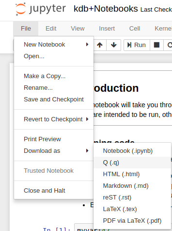

# Frequently-asked questions about JupyterQ


## Can I run the kernel remotely?

Yes, see the [Jupyter documentation](https://jupyter-notebook.readthedocs.io/en/stable/public_server.html). To set up a notebook server for multiple users Jupyter recommends [JupyterHub](https://jupyterhub.readthedocs.io/en/latest/index.html)


### Additional setup for JupyterQ under JupyterHub

If you see this error when running the Jupyter console on the server you’re installing on:

```txt
You may need to set LD_LIBRARY_PATH/DYLD_LIBRARY_PATH to your
python distribution's library directory: $HOME/anaconda3/lib
```

You will need to export the `LD_LIBRARY_PATH` and add this to your configuration file for JupyterHub

```python
c.Spawner.env_keep.append('LD_LIBRARY_PATH')
```

## Why is setting `LD_LIBRARY_PATH/DYLD_LIBRARY_PATH` required with Anaconda Python?

Anaconda packages libraries which may conflict with the system versions of these libraries loaded by q at startup e.g. `libssl` or `libz`. There is a Conda packaged version of q which doesn't require setting `LD_LIBRARY_PATH`. If you are already using Anaconda then you can install it with

```bash
conda install -c kx kdb
```

## How can I save the contents of a notebook to a q script?

To dump the entire contents of the code cells in a notebook to a q script use
_File > Download as > Q (.q)_.



To save the contents of individual cells as q scripts use `/%savescript` in a cell.

:point_right:
[Loading and saving scripts](https://github.com/KxSystems/ml/tree/master/docs/notebooks.md#loading-and-saving-code)


## Can I mix Python and q code in the same notebook? 

Yes, either with `p)` or `/%python`.

:point_right:
[Examples](https://github.com/KxSystems/ml/tree/master/docs/notebooks.md#python-and-inline-display)


## Is there a Docker image available?

Yes, if you have [Docker](https://docs.docker.com/install/) installed, you can run:

```bash
docker run -it --rm -p 8888:8888 kxsys/jupyterq
```

Further instructions for running headless and building the image are [available](https://github.com/KxSystems/jupyterq/blob/master/README.md#docker)

> **Always Linux**
> 
> Even if you are running Docker on macOS or Windows the version of kdb+ is 64-bit Linux, and the Docker image is Linux.


## Can I restrict the access to my notebook using passwords?

Yes, you can initialize a notebook which requires other processes to provide a valid *username:password* pair when trying to open a connection with the notebook.

:point_right:
[Restrict access](https://github.com/KxSystems/ml/tree/master/docs/notebooks.md#restrict-access-to-a-notebook-using-passwords)


