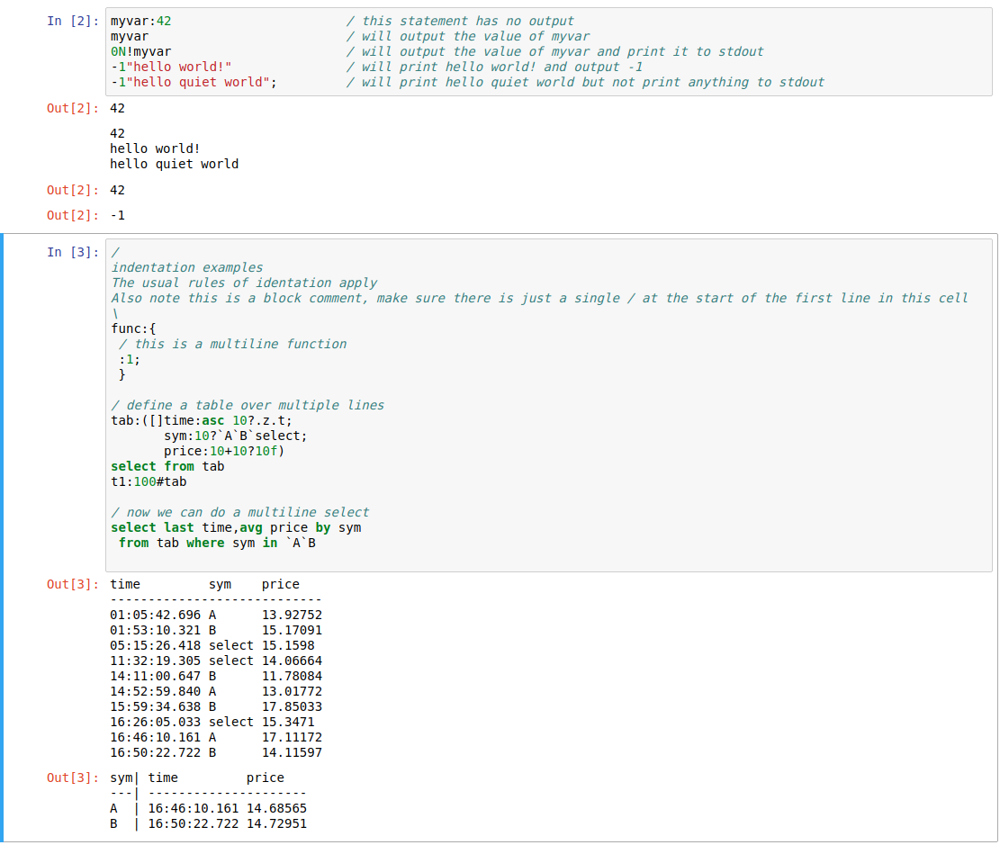
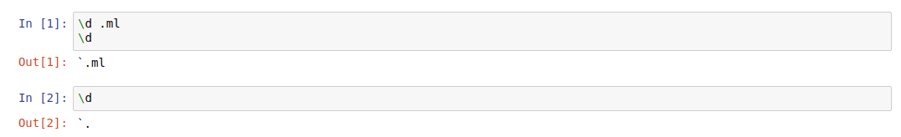
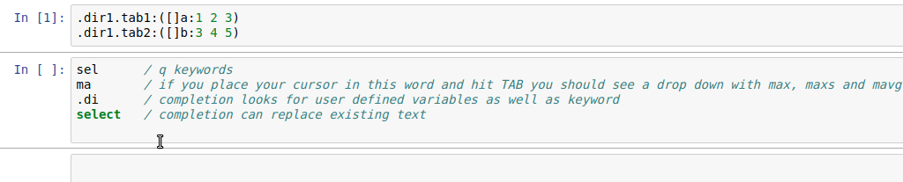
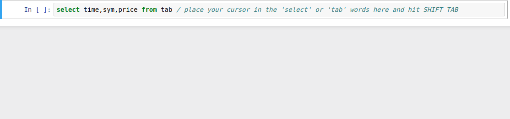
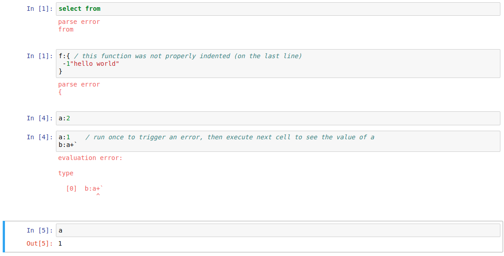
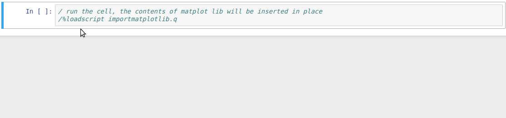
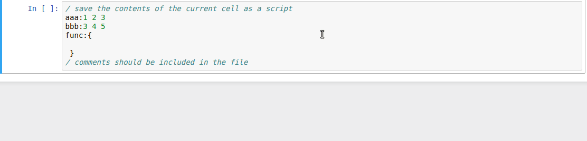
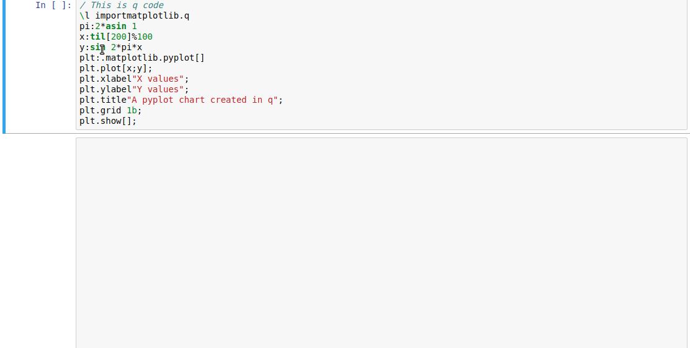
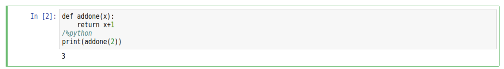

# JupyterQ user guide


## Running code

The simplest case is running some code and getting a result. Note here:

-   Each line of code which would produce output as a console produces output in the notebook.
-   stderr/stdout are printed separately to the output in the usual way for notebooks. Note that if your print statement, such as `-1"hello world!"`, has a result (here `-1`) then it will be displayed. (You can suppress this with a semicolon at the end of a statement as usual.)
-   Execution is script-like, i.e. you can use the normal rules of indentation for functions, if/while blocks, and select/update/delete statements.




## System commands

System commands can be used with the `\` escape character at the start of a line in a code cell.

> **Warning** 
> 
> Namespace setting using `\d` operates on a per cell basis so cannot be set for an entire notebook
> 
> 


## Code completion and getting help

The notebook supports code completion of q keywords and anything in the `.h`, `.Q`, `.z` and `.j` directories of q.

Completion also works on user-defined variables, provided they exist on the server. If you’ve defined variables in the _same_ cell they won’t exist yet in the server process before the cell is first executed, but notebooks will complete these for you locally.

Code completion in notebooks is accessed via the Tab key.





### Help

Help is available on q keywords and built in commands, embedPy and Python foreign objects, and user defined variables.
For user-defined variables the console representation along with datatype information is displayed.

In notebooks, help is accessed with Shift+Tab. This should pop up a window in the notebook. To see an HTML version of the help, with links to the online documentation for the function, press Shift+Tab four times in succession (or use the buttons in the Help window).




## Errors

Errors are displayed in red and fall into two classes.


### Parse errors

Parsing of the cell content is checked by the kernel before sending to the server for evaluation. The usual q parsing rules apply. Note that for foreign languages (lines preceded by `p)` for example) parsing is not checked.


### Evaluation errors

Runtime errors are reported from the server. One important thing to note is that as with q scripts, lines up to where the error occurred will have been executed.
```q
a:1
b:a+`
a:2
```
will result in `a` having a value of 1.


### Examples




## Loading and saving code


### Load

In addition to loading code with `\l` , code from a script _on the server_ can be loaded directly into a cell using a ‘magic’ command
```q
/%loadscript filename
```
This will not attempt to execute the code and any code in the rest of the cell will not execute.




### Save

```q
/%savescript filename [overwrite]
```

Will save contents of the cell as a script, optionally overwriting the script if it already exists




## Python and inline display

> :warning: **Experimental**

Along with q code, Python code can be run in a q process using [embedPy](https://github.com/kxsystems/embedpy), lines preceded by `p)` will be executed as Python code.
Charts created using matplotlib will be displayed inline in the notebook.



Cells with `/%python` anywhere in the cell at the start of a line will be evaluated entirely as Python code.
This is intended only to make it easier to copy and paste Python snippets into kdb+ notebooks.
The language for syntax highlighting, code completion and help is still q.




## Server command-line arguments

When opening a notebook or running a console, Jupyter starts the kdb+ kernel.
(You do not connect to an existing kdb+ process.)
The kdb+ kernel is split into two processes:

-   one handles all communication with the Jupyter front end (`jupyterq_kernel.q`)
-   another is where code is actually executed (`jupyterq_server.q`)

To set command-line arguments for these q processes, edit the Jupyter configuration file `kernel.json`. Here you can set arguments for either the kernel process or the server process. In practice you will likely only want to modify options for the server process as it is where all your code and data reside. The kernel process only manages communication with the Jupyter front end.

> **Restrict connections using passwords**
> 
> The command-line argument `-u` is not supported but `-U` is. See next section for how to restrict the access to the notebooks to authorized users.


Suppose you wanted to set the default timer interval to 1 second, and a workspace limit of 500 MB. You would change the `kernel.json` file from the default:
```json
{
 "argv": [
  "q",
  "jupyterq_kernel.q",
  "-cds",
  "{connection_file}"
 ],
 "display_name": "Q 3.5",
 "language": "q",
 "env": {"JUPYTERQ_SERVERARGS":""}
}
```

To this:

```json
{
 "argv": [
  "q",
  "jupyterq_kernel.q",
  "-cds",
  "{connection_file}"
 ],
 "display_name": "Q 3.5",
 "language": "q",
 "env": {"JUPYTERQ_SERVERARGS":"-t 1000 -w 500"}
}
```

To locate the config file after install run:

```bash
jupyter kernelspec list
```

The `kernel.json` file is located in the directory listed for the `qpk` kernel.


## Restrict access to a notebook using passwords

To open a port for the server or kernel process with user authentication enabled, specify `-U` (not `-u`) in command-line options for the server and kernel. You need to provide a valid username and password to allow connections to the kernel and server, in an environment variable `JUPYTERQ_LOGIN` e.g. `kernel.json` might look like this:

```json
{
 "argv": [
  "q",
  "jupyterq_kernel.q",
  "-U",
  "kernuser.txt",
  "-cds",
  "{connection_file}"
 ],
 "display_name": "Q (kdb+)",
 "language": "q",
 "env": {"JUPYTERQ_SERVERARGS":"-U servuser.txt","MPLBACKEND":"Agg"}
}
```

You can then use separate password files for the kernel and server, but `JUPYTERQ_LOGIN` must contain a username password combination valid for both processes.

```txt
$ cat servuser.txt # password stored hashed
user1:5f4dcc3b5aa765d61d8327deb882cf99
user2:5f4dcc3b5aa765d61d8327deb882cf99
$ cat kernuser.txt # passwords can also be stored in plaintext
user1:password
$ export JUPYTERQ_LOGIN=user1:password
#should work
$ jupyter-console --kernel=qpk
…
Jupyter console 5.1.0

KDB+ v3.6 2018.06.01 kdb+ kernel for jupyter, jupyterQ vdevelopment
In [1]:

…
#shouldn't work as login not valid for both kernel and server
$ JUPYTERQ_LOGIN=user2:password jupyter-console --kernel=qpk processes
*******************************************
** Wrong user:password in JUPYTERQ_LOGIN **
*******************************************
Press Ctrl+C
```


### Opening a connection

Set the listening port before opening a connection with another process (as it is set to 0 for both kernel and server processes when JupyterQ is initialized), e.g. `\p 1234`

```bash
$ jupyter-console --kernel=qpk
…
Jupyter console 5.1.0

KDB+ v3.6 2018.06.01 kdb+ kernel for jupyter, jupyterQ vdevelopment
In [1]: \p
Out[1]:
0i

In [2]: \p 1234

…
```
